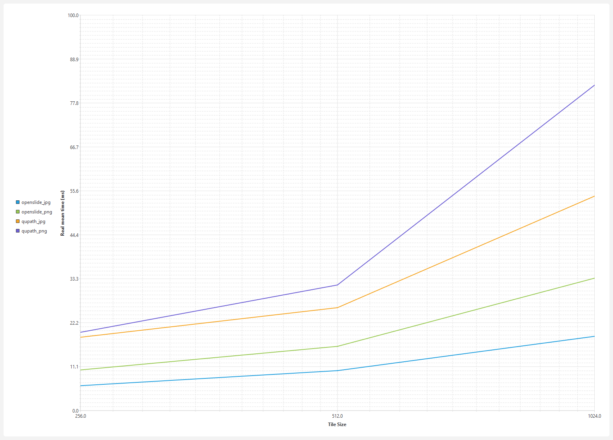
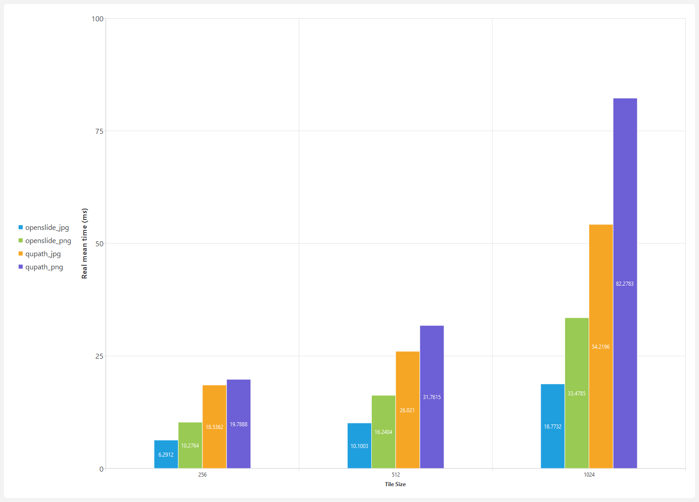
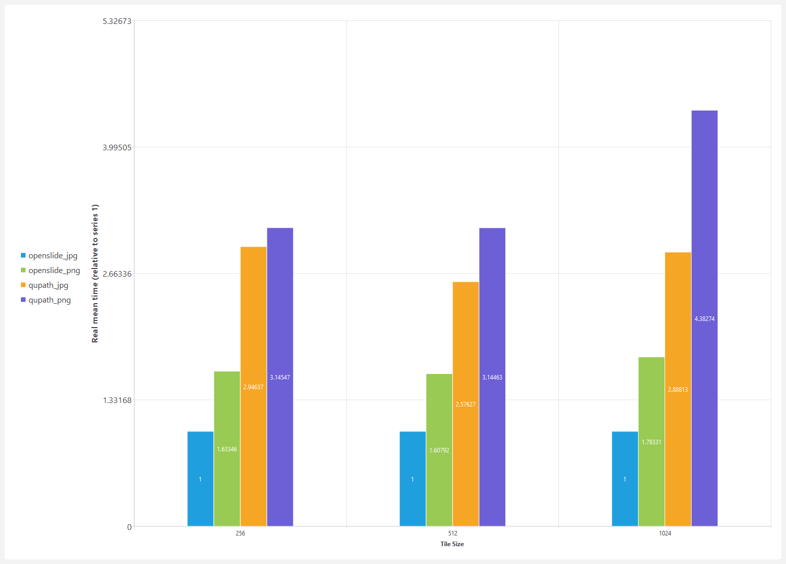
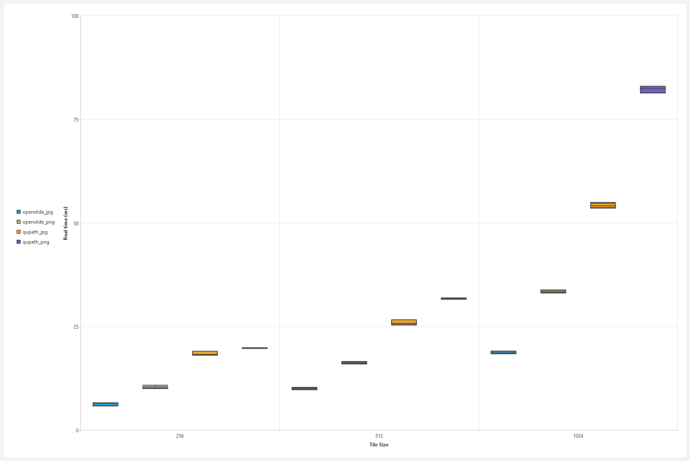

#

# Benchmark results

- 
-  
- 

```sh
Run on (24 X 2112 MHz CPU s)
CPU Caches:
  L1 Data 48 KiB (x12)
  L1 Instruction 32 KiB (x12)
  L2 Unified 2048 KiB (x12)
  L3 Unified 30720 KiB (x1)

tile_size: 254 overlap: 1

-----------------------------------------------------------------------------------------------------------------------------
Benchmark                                                                                   Time             CPU   Iterations
-----------------------------------------------------------------------------------------------------------------------------
openslide_jpg<int>/256/1024/iterations:200/repeats:5/process_time/real_time              6.59 ms         9.30 ms          200
openslide_jpg<int>/256/1024/iterations:200/repeats:5/process_time/real_time              5.95 ms         5.00 ms          200
openslide_jpg<int>/256/1024/iterations:200/repeats:5/process_time/real_time              6.58 ms         5.00 ms          200
openslide_jpg<int>/256/1024/iterations:200/repeats:5/process_time/real_time              5.85 ms         4.84 ms          200
openslide_jpg<int>/256/1024/iterations:200/repeats:5/process_time/real_time              6.49 ms         4.77 ms          200
openslide_jpg<int>/256/1024/iterations:200/repeats:5/process_time/real_time_mean         6.29 ms         5.78 ms            5
openslide_jpg<int>/256/1024/iterations:200/repeats:5/process_time/real_time_median       6.49 ms         5.00 ms            5
openslide_jpg<int>/256/1024/iterations:200/repeats:5/process_time/real_time_stddev      0.360 ms         1.97 ms            5
openslide_jpg<int>/256/1024/iterations:200/repeats:5/process_time/real_time_cv           5.72 %         34.04 %             5

openslide_png<int>/256/1024/iterations:200/repeats:5/process_time/real_time              10.2 ms         8.20 ms          200
openslide_png<int>/256/1024/iterations:200/repeats:5/process_time/real_time              10.0 ms         8.20 ms          200
openslide_png<int>/256/1024/iterations:200/repeats:5/process_time/real_time              10.1 ms         8.52 ms          200
openslide_png<int>/256/1024/iterations:200/repeats:5/process_time/real_time              10.2 ms         8.59 ms          200
openslide_png<int>/256/1024/iterations:200/repeats:5/process_time/real_time              10.9 ms         8.75 ms          200
openslide_png<int>/256/1024/iterations:200/repeats:5/process_time/real_time_mean         10.3 ms         8.45 ms            5
openslide_png<int>/256/1024/iterations:200/repeats:5/process_time/real_time_median       10.2 ms         8.52 ms            5
openslide_png<int>/256/1024/iterations:200/repeats:5/process_time/real_time_stddev      0.328 ms        0.243 ms            5
openslide_png<int>/256/1024/iterations:200/repeats:5/process_time/real_time_cv           3.19 %          2.88 %             5

qupath_jpg<int>/256/1024/iterations:200/repeats:5/process_time/real_time                 19.6 ms         29.7 ms          200
qupath_jpg<int>/256/1024/iterations:200/repeats:5/process_time/real_time                 18.5 ms         28.2 ms          200
qupath_jpg<int>/256/1024/iterations:200/repeats:5/process_time/real_time                 18.3 ms         30.5 ms          200
qupath_jpg<int>/256/1024/iterations:200/repeats:5/process_time/real_time                 18.2 ms         28.5 ms          200
qupath_jpg<int>/256/1024/iterations:200/repeats:5/process_time/real_time                 18.1 ms         30.9 ms          200
qupath_jpg<int>/256/1024/iterations:200/repeats:5/process_time/real_time_mean            18.5 ms         29.5 ms            5
qupath_jpg<int>/256/1024/iterations:200/repeats:5/process_time/real_time_median          18.3 ms         29.7 ms            5
qupath_jpg<int>/256/1024/iterations:200/repeats:5/process_time/real_time_stddev         0.615 ms         1.17 ms            5
qupath_jpg<int>/256/1024/iterations:200/repeats:5/process_time/real_time_cv              3.32 %          3.95 %             5

qupath_png<int>/256/1024/iterations:200/repeats:5/process_time/real_time                 19.8 ms         29.7 ms          200
qupath_png<int>/256/1024/iterations:200/repeats:5/process_time/real_time                 19.8 ms         29.5 ms          200
qupath_png<int>/256/1024/iterations:200/repeats:5/process_time/real_time                 19.9 ms         32.2 ms          200
qupath_png<int>/256/1024/iterations:200/repeats:5/process_time/real_time                 19.8 ms         32.6 ms          200
qupath_png<int>/256/1024/iterations:200/repeats:5/process_time/real_time                 19.7 ms         34.0 ms          200
qupath_png<int>/256/1024/iterations:200/repeats:5/process_time/real_time_mean            19.8 ms         31.6 ms            5
qupath_png<int>/256/1024/iterations:200/repeats:5/process_time/real_time_median          19.8 ms         32.2 ms            5
qupath_png<int>/256/1024/iterations:200/repeats:5/process_time/real_time_stddev         0.064 ms         1.95 ms            5
qupath_png<int>/256/1024/iterations:200/repeats:5/process_time/real_time_cv              0.33 %          6.18 %             5


tile_size: 510 overlap: 1

-----------------------------------------------------------------------------------------------------------------------------
Benchmark                                                                                   Time             CPU   Iterations
-----------------------------------------------------------------------------------------------------------------------------
openslide_jpg<int>/512/1024/iterations:200/repeats:5/process_time/real_time              10.2 ms         11.9 ms          200
openslide_jpg<int>/512/1024/iterations:200/repeats:5/process_time/real_time              10.3 ms         7.89 ms          200
openslide_jpg<int>/512/1024/iterations:200/repeats:5/process_time/real_time              9.76 ms         6.48 ms          200
openslide_jpg<int>/512/1024/iterations:200/repeats:5/process_time/real_time              10.1 ms         8.20 ms          200
openslide_jpg<int>/512/1024/iterations:200/repeats:5/process_time/real_time              10.1 ms         7.73 ms          200
openslide_jpg<int>/512/1024/iterations:200/repeats:5/process_time/real_time_mean         10.1 ms         8.44 ms            5
openslide_jpg<int>/512/1024/iterations:200/repeats:5/process_time/real_time_median       10.1 ms         7.89 ms            5
openslide_jpg<int>/512/1024/iterations:200/repeats:5/process_time/real_time_stddev      0.212 ms         2.03 ms            5
openslide_jpg<int>/512/1024/iterations:200/repeats:5/process_time/real_time_cv           2.10 %         24.06 %             5

openslide_png<int>/512/1024/iterations:200/repeats:5/process_time/real_time              16.2 ms         13.8 ms          200
openslide_png<int>/512/1024/iterations:200/repeats:5/process_time/real_time              16.6 ms         14.1 ms          200
openslide_png<int>/512/1024/iterations:200/repeats:5/process_time/real_time              16.3 ms         13.7 ms          200
openslide_png<int>/512/1024/iterations:200/repeats:5/process_time/real_time              16.0 ms         13.9 ms          200
openslide_png<int>/512/1024/iterations:200/repeats:5/process_time/real_time              16.2 ms         14.1 ms          200
openslide_png<int>/512/1024/iterations:200/repeats:5/process_time/real_time_mean         16.2 ms         13.9 ms            5
openslide_png<int>/512/1024/iterations:200/repeats:5/process_time/real_time_median       16.2 ms         13.9 ms            5
openslide_png<int>/512/1024/iterations:200/repeats:5/process_time/real_time_stddev      0.222 ms        0.187 ms            5
openslide_png<int>/512/1024/iterations:200/repeats:5/process_time/real_time_cv           1.37 %          1.34 %             5

qupath_jpg<int>/512/1024/iterations:200/repeats:5/process_time/real_time                 27.2 ms         35.1 ms          200
qupath_jpg<int>/512/1024/iterations:200/repeats:5/process_time/real_time                 26.1 ms         47.0 ms          200
qupath_jpg<int>/512/1024/iterations:200/repeats:5/process_time/real_time                 25.8 ms         41.8 ms          200
qupath_jpg<int>/512/1024/iterations:200/repeats:5/process_time/real_time                 25.6 ms         43.8 ms          200
qupath_jpg<int>/512/1024/iterations:200/repeats:5/process_time/real_time                 25.4 ms         41.3 ms          200
qupath_jpg<int>/512/1024/iterations:200/repeats:5/process_time/real_time_mean            26.0 ms         41.8 ms            5
qupath_jpg<int>/512/1024/iterations:200/repeats:5/process_time/real_time_median          25.8 ms         41.8 ms            5
qupath_jpg<int>/512/1024/iterations:200/repeats:5/process_time/real_time_stddev         0.702 ms         4.38 ms            5
qupath_jpg<int>/512/1024/iterations:200/repeats:5/process_time/real_time_cv              2.70 %         10.47 %             5

qupath_png<int>/512/1024/iterations:200/repeats:5/process_time/real_time                 31.9 ms         52.3 ms          200
qupath_png<int>/512/1024/iterations:200/repeats:5/process_time/real_time                 31.6 ms         45.7 ms          200
qupath_png<int>/512/1024/iterations:200/repeats:5/process_time/real_time                 31.8 ms         48.8 ms          200
qupath_png<int>/512/1024/iterations:200/repeats:5/process_time/real_time                 31.6 ms         51.7 ms          200
qupath_png<int>/512/1024/iterations:200/repeats:5/process_time/real_time                 31.9 ms         53.8 ms          200
qupath_png<int>/512/1024/iterations:200/repeats:5/process_time/real_time_mean            31.8 ms         50.5 ms            5
qupath_png<int>/512/1024/iterations:200/repeats:5/process_time/real_time_median          31.8 ms         51.7 ms            5
qupath_png<int>/512/1024/iterations:200/repeats:5/process_time/real_time_stddev         0.144 ms         3.24 ms            5
qupath_png<int>/512/1024/iterations:200/repeats:5/process_time/real_time_cv              0.45 %          6.42 %             5


tile_size: 1022 overlap: 1

------------------------------------------------------------------------------------------------------------------------------
Benchmark                                                                                    Time             CPU   Iterations
------------------------------------------------------------------------------------------------------------------------------
openslide_jpg<int>/1024/1024/iterations:200/repeats:5/process_time/real_time              19.1 ms         19.8 ms          200
openslide_jpg<int>/1024/1024/iterations:200/repeats:5/process_time/real_time              19.1 ms         15.5 ms          200
openslide_jpg<int>/1024/1024/iterations:200/repeats:5/process_time/real_time              18.4 ms         14.9 ms          200
openslide_jpg<int>/1024/1024/iterations:200/repeats:5/process_time/real_time              18.6 ms         15.6 ms          200
openslide_jpg<int>/1024/1024/iterations:200/repeats:5/process_time/real_time              18.7 ms         15.1 ms          200
openslide_jpg<int>/1024/1024/iterations:200/repeats:5/process_time/real_time_mean         18.8 ms         16.2 ms            5
openslide_jpg<int>/1024/1024/iterations:200/repeats:5/process_time/real_time_median       18.7 ms         15.5 ms            5
openslide_jpg<int>/1024/1024/iterations:200/repeats:5/process_time/real_time_stddev      0.284 ms         2.06 ms            5
openslide_jpg<int>/1024/1024/iterations:200/repeats:5/process_time/real_time_cv           1.51 %         12.75 %             5

openslide_png<int>/1024/1024/iterations:200/repeats:5/process_time/real_time              33.4 ms         29.1 ms          200
openslide_png<int>/1024/1024/iterations:200/repeats:5/process_time/real_time              33.1 ms         29.0 ms          200
openslide_png<int>/1024/1024/iterations:200/repeats:5/process_time/real_time              33.4 ms         28.9 ms          200
openslide_png<int>/1024/1024/iterations:200/repeats:5/process_time/real_time              33.8 ms         29.9 ms          200
openslide_png<int>/1024/1024/iterations:200/repeats:5/process_time/real_time              33.7 ms         29.5 ms          200
openslide_png<int>/1024/1024/iterations:200/repeats:5/process_time/real_time_mean         33.5 ms         29.3 ms            5
openslide_png<int>/1024/1024/iterations:200/repeats:5/process_time/real_time_median       33.4 ms         29.1 ms            5
openslide_png<int>/1024/1024/iterations:200/repeats:5/process_time/real_time_stddev      0.289 ms        0.424 ms            5
openslide_png<int>/1024/1024/iterations:200/repeats:5/process_time/real_time_cv           0.86 %          1.45 %             5

qupath_jpg<int>/1024/1024/iterations:200/repeats:5/process_time/real_time                 54.2 ms         81.2 ms          200
qupath_jpg<int>/1024/1024/iterations:200/repeats:5/process_time/real_time                 53.6 ms          156 ms          200
qupath_jpg<int>/1024/1024/iterations:200/repeats:5/process_time/real_time                 55.0 ms          167 ms          200
qupath_jpg<int>/1024/1024/iterations:200/repeats:5/process_time/real_time                 54.6 ms          179 ms          200
qupath_jpg<int>/1024/1024/iterations:200/repeats:5/process_time/real_time                 53.8 ms          166 ms          200
qupath_jpg<int>/1024/1024/iterations:200/repeats:5/process_time/real_time_mean            54.2 ms          150 ms            5
qupath_jpg<int>/1024/1024/iterations:200/repeats:5/process_time/real_time_median          54.2 ms          166 ms            5
qupath_jpg<int>/1024/1024/iterations:200/repeats:5/process_time/real_time_stddev         0.549 ms         39.2 ms            5
qupath_jpg<int>/1024/1024/iterations:200/repeats:5/process_time/real_time_cv              1.01 %         26.15 %             5

qupath_png<int>/1024/1024/iterations:200/repeats:5/process_time/real_time                 81.4 ms          239 ms          200
qupath_png<int>/1024/1024/iterations:200/repeats:5/process_time/real_time                 82.7 ms          273 ms          200
qupath_png<int>/1024/1024/iterations:200/repeats:5/process_time/real_time_mean            82.3 ms          254 ms            5
qupath_png<int>/1024/1024/iterations:200/repeats:5/process_time/real_time_median          82.5 ms          257 ms            5
qupath_png<int>/1024/1024/iterations:200/repeats:5/process_time/real_time_stddev         0.813 ms         17.3 ms            5
qupath_png<int>/1024/1024/iterations:200/repeats:5/process_time/real_time_cv              0.99 %          6.79 %             5
```